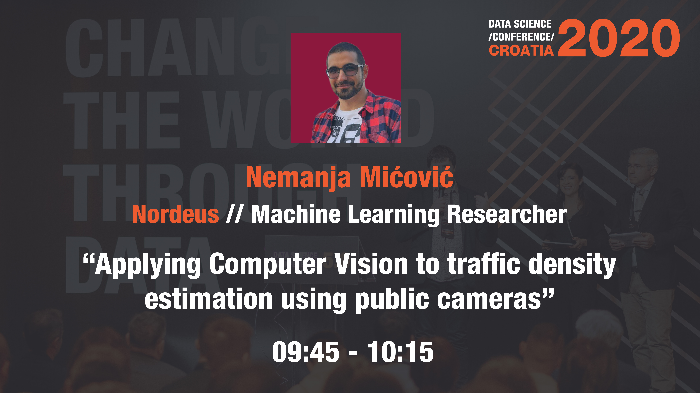

# Data Science Croatia 2020 - Applying Computer Vision to traffic density estimation using public cameras

Presentation of the talk I gave at [Data Science Croatia 2020](https://croatia.datasciconference.com/) conference.
Main topic of the talk was applying modern computer vision algorithms to traffic density estimation.

Video of the talk is available [here](https://youtu.be/EcvYbHy0J8M). Slides are available through this repository.

